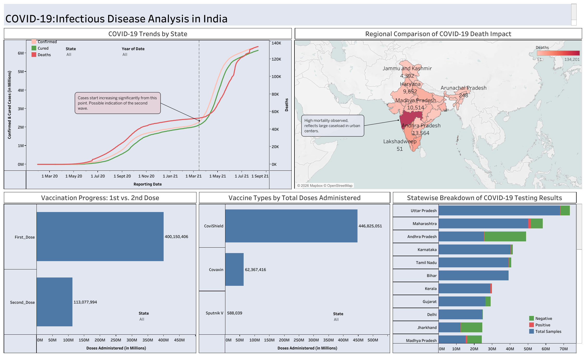

# COVID-19 India Dashboard | Tableau Project

## 📌 Project Overview
This project analyzes the spread, mortality, recovery trends, vaccination progress, and testing performance of COVID-19 across Indian states using interactive Tableau dashboards.

The goal is to provide data-driven insights to support public health decision-making through visual analytics.

🔗 **Live Interactive Dashboard (Tableau Public):**
[View Dashboard Here](https://public.tableau.com/shared/2HYGHHQJ4?:display_count=n&:origin=viz_share_link)

---

## 🎯 Business Problem

During the COVID-19 pandemic, decision-makers faced challenges in:
- Monitoring state-wise infection trends
- Tracking vaccination progress
- Understanding mortality and recovery rates
- Allocating healthcare resources effectively

This dashboard consolidates multiple datasets to provide a unified analytical view of the pandemic in India.

---

## 📊 Dataset

Source:

🔗 **Kaggle: COVID-19 in India Dataset:**
[View Dataset Here](https://www.kaggle.com/datasets/sudalairajkumar/covid19-in-india)

🔗 **India GIS Map Dataset:**
[Required Map Dataset Here](https://simplemaps.com/gis/country/in)

Key attributes used:
- Date
- State/Union Territory
- Confirmed Cases
- Cured Cases
- Deaths
- First & Second Dose Administered
- Testing Data

---

## ⚙️ Data Preparation

The following preprocessing steps were applied:

- Handling missing values using IFNULL()
- Data type conversion (numeric measures)
- Removal of unrealistic values
- Creation of calculated fields:
  - Mortality Rate = Deaths / Confirmed Cases
  - Recovery Rate = Cured Cases / Confirmed Cases
- Dataset blending for geographic mapping

---

## 📈 Dashboard Components

### 1️⃣ Dual-Axis Line Chart
- Tracks confirmed, cured, and death trends
- Identifies pandemic waves (notable spike in early 2021)

### 2️⃣ Geographic Map
- State-wise death intensity visualization
- Helps identify high-risk regions

### 3️⃣ Vaccination Progress (Bar Chart)
- Comparison of First vs Second Dose
- Highlights vaccination drop-offs

### 4️⃣ Vaccine Type Distribution
- Covishield vs Covaxin vs Sputnik comparison

### 5️⃣ Testing Performance (Stacked Bar Chart)
- State-wise Positive vs Negative vs Total Samples
- Evaluates detection efficiency

---

## 🧠 Key Insights

- Significant spike during the second wave in 2021
- Maharashtra shows high mortality concentration
- Gap observed between first and second dose administration
- Testing expansion correlated with spike detection

---

## 🛠 Tools Used

- Tableau Public
- Data Blending
- Calculated Fields
- Geographic Mapping
- Interactive Filters & Tooltips

---

## 📷 Dashboard Preview

(Add your screenshots below)

---

## 🔮 Future Improvements

- Integrate real-time data
- Add predictive modeling for outbreak forecasting
- Cross-country comparative dashboard

---

## 👨‍💻 Author

Yokesh Gajendran  
MSc Data Analytics  
